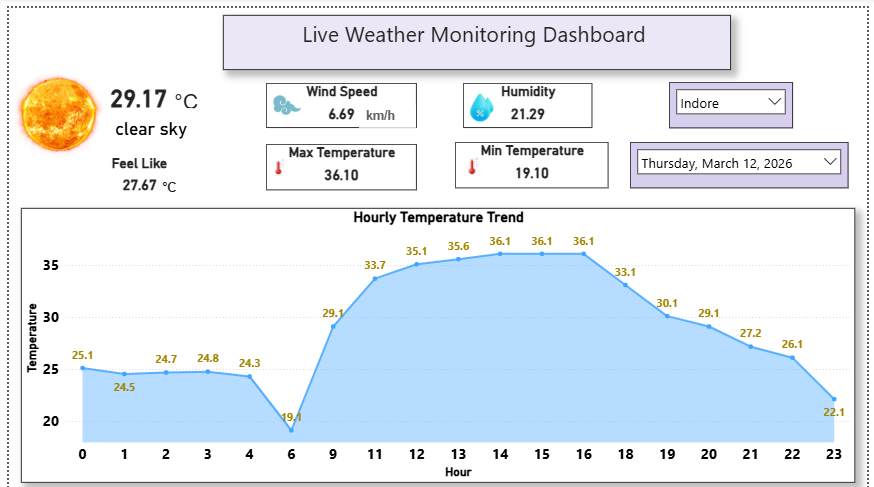
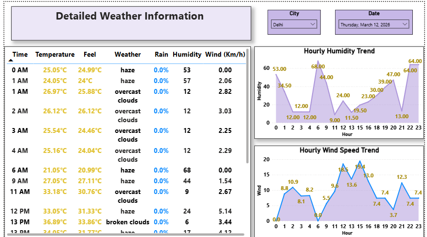

# 🌦️ Live Weather Monitoring Dashboard

## 📌 Project Overview

The **Live Weather Monitoring Dashboard** is a real-time data analytics project that automatically collects weather data from an API, stores it in cloud storage, and visualizes insights through an interactive dashboard built with Microsoft Power BI.

The system fetches live weather data using a Python script, stores the data in an AWS S3 bucket, and Power BI connects to the cloud storage to automatically refresh the dashboard every hour.

This project demonstrates skills in **API data extraction, cloud data storage, automation, and data visualization.**

---

# 🚀 Key Features

- Fetches **live weather data from API**
- Stores data automatically in **AWS S3 bucket**
- **Automated hourly data updates**
- Interactive dashboard built using **Microsoft Power BI**
- Hourly temperature trend analysis
- Wind speed and humidity monitoring
- Multi-page analytical dashboard

---

# 🏗️ System Architecture

Weather API → Python Script → AWS S3 Bucket → Power BI Dashboard

1. Python script extracts weather data from API  
2. Data is processed and stored in **AWS S3 bucket**  
3. **Power BI** connects to the S3 dataset  
4. Dashboard refreshes automatically every hour  
5. Users can monitor live weather trends

---

# 📊 Dashboard Pages

## 1️⃣ Weather Overview Dashboard

This page shows high-level weather insights.

Includes:
- Current Temperature
- Feels Like Temperature
- Maximum Temperature
- Minimum Temperature
- Wind Speed
- Humidity
- Hourly Temperature Trend Chart

📌 **Insight Discovered**

From the analysis of hourly temperature trends, the **lowest temperature usually occurs around 6 AM**.

---

## 2️⃣ Detailed Weather Information

This page provides deeper analysis of the hourly weather data.

Includes:

- Hourly weather data table
- Hourly humidity trend
- Hourly wind speed trend
- Rain percentage
- Weather condition tracking

---

# 📷 Dashboard Screenshots

## Weather Overview Dashboard

---

## Detailed Weather Analytics

---

# 🛠️ Technologies Used

| Technology | Purpose |
|------------|--------|
| Python | Weather API data extraction |
| Weather API | Real-time weather data source |
| AWS S3 | Cloud data storage |
| Microsoft Power BI | Data visualization and dashboard |
| AWS Cloud | Automated data pipeline |

---

# 🔄 Automation

The entire system is automated:

- Weather data fetched from API
- Data stored in AWS S3
- Power BI connected to cloud storage
- Dashboard automatically refreshes hourly

This enables **continuous real-time weather monitoring without manual updates.**

---

# 📂 Project Structure
